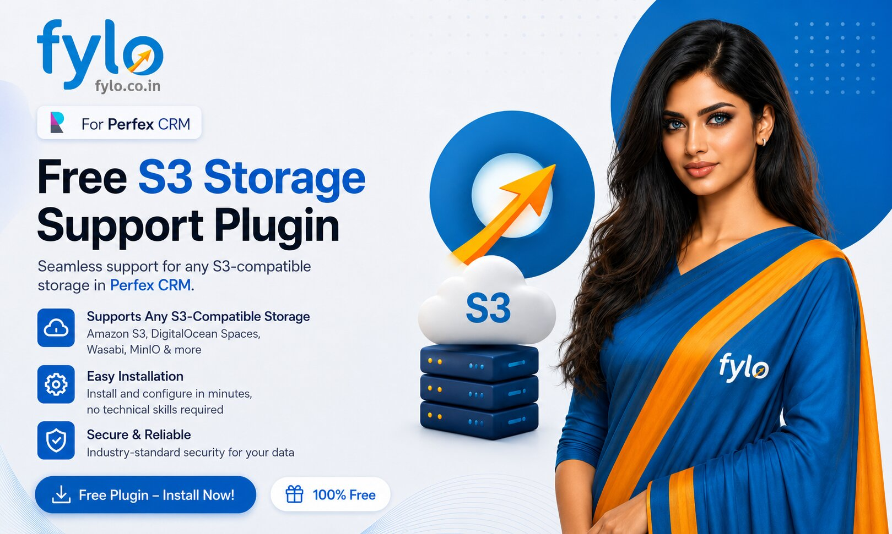

<<<<<<< HEAD
# perfex-s3-storage-plugin
Open-source Amazon S3 and S3-compatible storage integration for Perfex CRM
=======

  

  <h1 align="center">Amazon S3 Storage Module for Perfex CRM</h1>

  

    <strong>The ultimate cloud storage integration for Perfex - Powerful Open Source CRM.</strong>
     
    Offload your CRM attachments, project files, and profile images to Amazon S3 (or compatible object storage) seamlessly.
     
     
    <a href="https://www.fylo.co.in"><strong>Visit our Website »</strong></a>
    ·
    <a href="mailto:hello@fylo.co.in"><strong>Contact Support »</strong></a>
  

  

    
    
    
    
  

---

## 🚀 Overview

The **Amazon S3 Storage Module** is a robust, highly-optimized plugin designed specifically for **[Perfex - Powerful Open Source CRM](https://www.perfexcrm.com/)**. It completely replaces local file storage with Amazon S3 or any S3-compatible cloud storage (like DigitalOcean Spaces, Wasabi, or Cloudflare R2). 

If you are looking for the **best Perfex CRM S3 plugin** or a **Perfex cloud storage integration**, this module is the perfect solution. By integrating this extension, you instantly reduce your server's disk space usage, improve global load times via CDN capabilities, and ensure enterprise-grade backup redundancy for all your sensitive CRM documents.

## ✨ Key Features

- **Seamless Core Integration:** Intercepts native Perfex CRM uploads seamlessly.
- **Zero Local Footprint:** Directly syncs local uploads to S3 and automatically cleans up the local server.
- **Full Module Coverage:** Supports Project Files, Ticket Attachments, Client Files, Lead Attachments, Expense Receipts, Staff Profile Images, and Company Logos.
- **S3-Compatible Support:** Works beautifully with AWS S3, DigitalOcean Spaces, Wasabi, Linode Object Storage, and Cloudflare R2.
- **CDN Ready:** Serve your CRM assets at blazing speeds via custom `s3_base_url` mapping.
- **Smart Cleanup:** Automatically deletes files from your S3 bucket when they are deleted from inside Perfex CRM.

## 🛠️ Installation Guide

### How to Download from GitHub
You can download this module directly from GitHub using one of two methods:
- **Method 1 (Download ZIP):** Click on the green **`Code`** button at the top right of the repository page and select **`Download ZIP`**. Extract the downloaded ZIP file.
- **Method 2 (Git Clone):** Open your terminal and run: `git clone https://github.com/YOUR-USERNAME/YOUR-REPO-NAME.git s3_storage` (Make sure to replace with your actual repository URL).

### Installation Steps

1. Upload the `s3_storage` folder (extracted or cloned) to your Perfex CRM installation directory at: `application/modules/` or `modules/`.
2. If you cloned directly from GitHub, navigate to the `s3_storage` folder in your terminal and run `composer install` to download the AWS SDK dependencies. (If you downloaded a packaged release ZIP, skip this step).
3. Log in to your Perfex CRM as an Administrator.
5. Go to **Setup -> Modules** (`/admin/modules`).
6. Find **S3 Storage** in the list (you will see the author listed as [Fylo](https://www.fylo.co.in)) and click **Activate**.
7. Navigate to **Setup -> Settings -> S3 Storage** and configure your bucket credentials:
   - S3 Access Key
   - S3 Secret Key
   - S3 Bucket Name
   - S3 Region
   - S3 Base URL (for CDN/CloudFront)

## 💖 Support Our Open Source Work

We are passionate about building high-quality, free plugins for the community! Countless hours of development, testing, and optimization go into making these modules seamless and powerful.

If this plugin has helped you or your business, **please consider supporting us**. Even a contribution of ₹1 makes a huge difference and motivates us to create more amazing free tools for you!

Every single contribution helps us keep the servers running and the code flowing. **Thank you so much!** 🙌

## 💼 About Fylo

This plugin was proudly developed by **[Fylo](https://www.fylo.co.in)**. We specialize in building cutting-edge integrations, modern cloud solutions, and scalable plugins for enterprise systems.

Have a custom requirement or need dedicated support? We're here to help!

- **Website:** [www.fylo.co.in](https://www.fylo.co.in)
- **Email:** [hello@fylo.co.in](mailto:hello@fylo.co.in)

## 📄 License & Copyright

All rights reserved by **[Fylo](https://www.fylo.co.in)**.

By purchasing or downloading this module, you are granted a license to use it on your Perfex CRM installation. Unauthorized distribution, reselling, or modification without consent is strictly prohibited. For full licensing details, please contact [hello@fylo.co.in](mailto:hello@fylo.co.in).

---

  Built with ❤️ by <a href="https://www.fylo.co.in">Fylo.co.in</a> for the Perfex CRM Community.

>>>>>>> a444755 (plugin)
